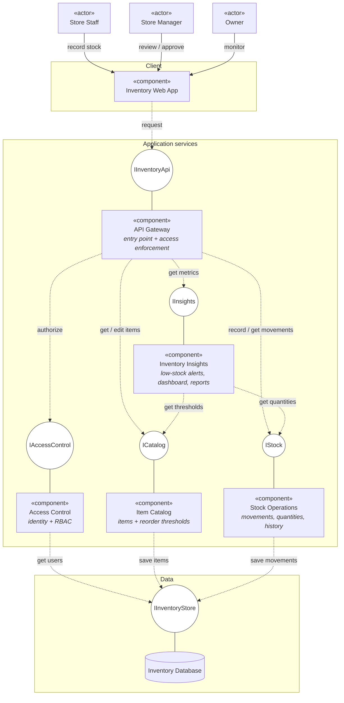
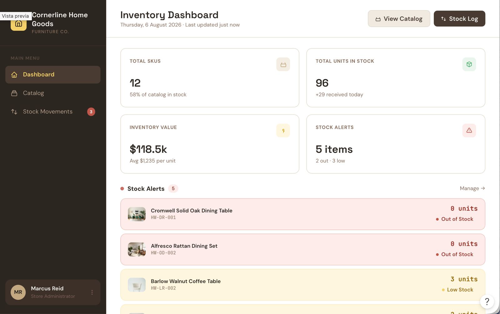
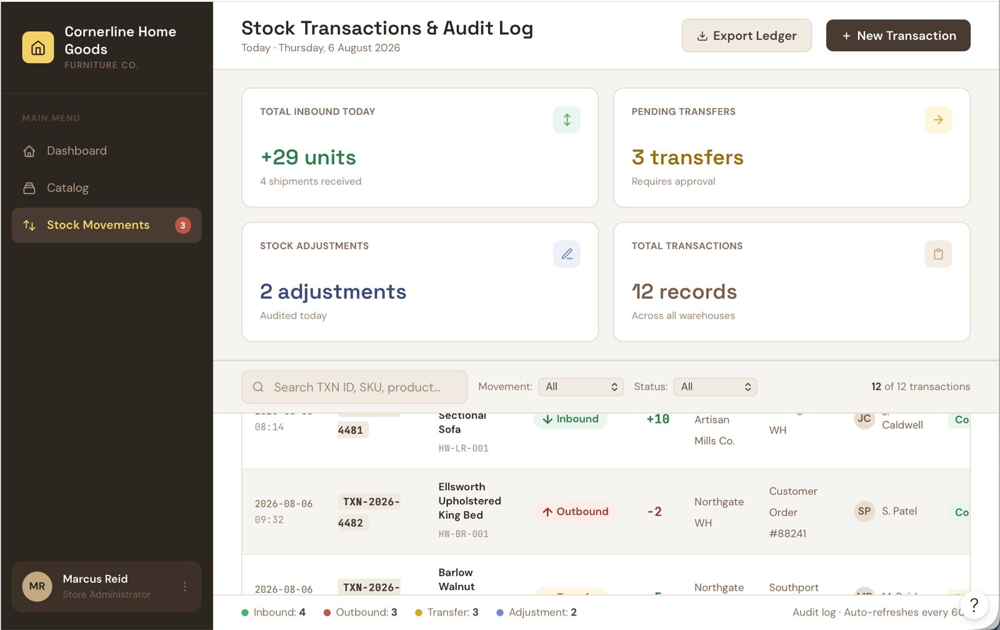
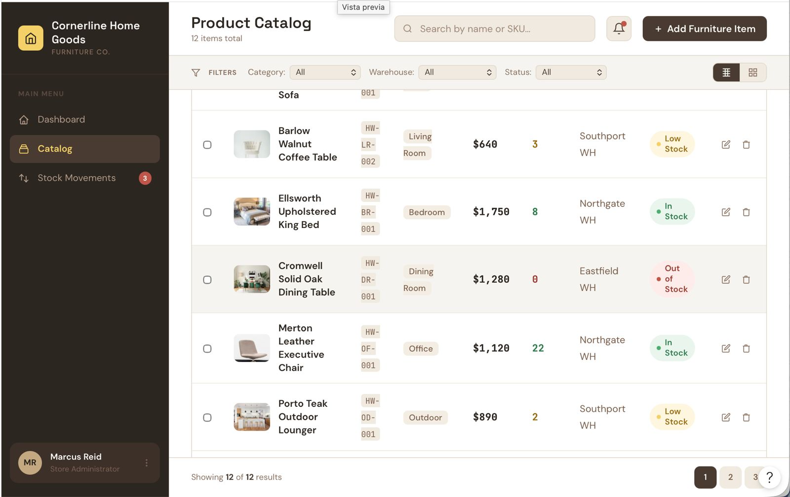

# Diagrams

## Use cases

## Architecture Diagram

## Modelo de Datos

## Component diagram

---

# Mockups

https://www.figma.com/make/flrV3EonGBeck7xceHvUca/Furniture-Inventory-Dashboard-Design?fullscreen=1&t=pX2k4jXAPjgFipS5-1&code-node-id=0-6

