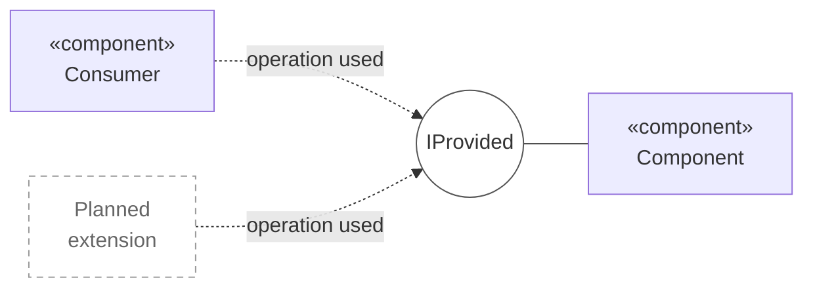
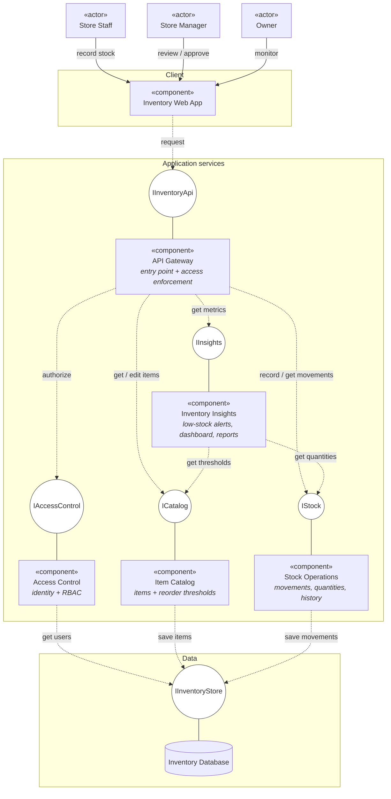
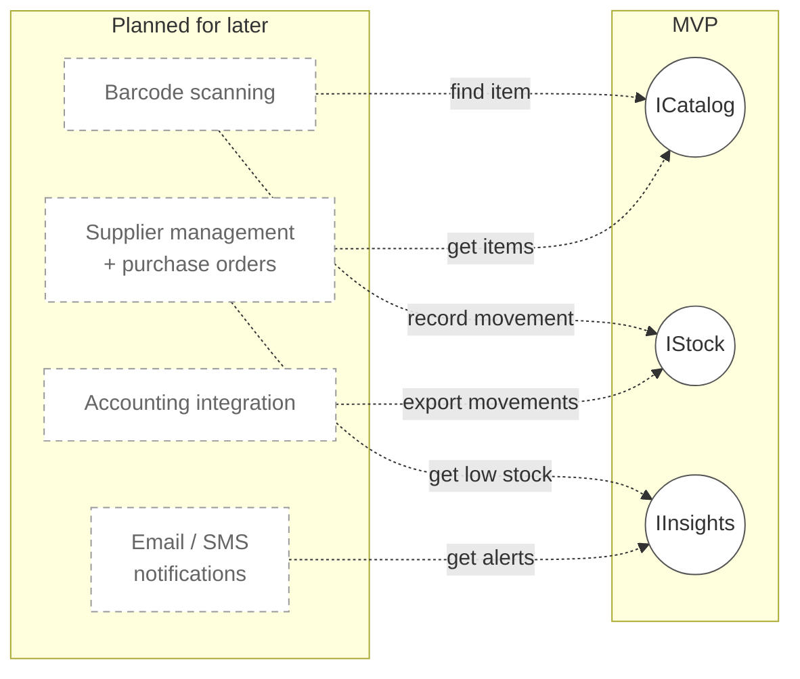

# Component Diagram

High-level component view of the Retail Inventory Management System for
Cornerline Home Goods.

Derived from [`statement-of-work-01.md`](../proposals/statement-of-work-01.md)
and [`discovery-and-scoping.md`](../discovery-and-scoping.md).

Components are grouped by **capability**, not by technology or by module: the
stack, the data model and several business rules are still open, so this view is
deliberately coarse and should survive those decisions. Components talk only
through interfaces — lollipop = provided, dashed arrow = required.

---

## 1. Notation

| Symbol | Meaning |
| --- | --- |
| `«component»` box | A capability of the system that can be built and replaced on its own |
| Circle | **Provided interface** — the contract the component exposes |
| Solid line circle—component | The component realizes that interface |
| Dashed arrow → circle | **Required interface** — a `«use»` dependency |
| Label on an arrow | The operation the consumer invokes, in short form |
| Dashed grey box | Out of MVP scope, planned for later |
| Cylinder | Persistent data store |

Realization lines carry no label: they say *"this component implements this
contract"*, not *"this component calls something"*.

---

## 2. Component diagram

---

## 3. Interfaces

| Interface | Provided by | Contract |
| --- | --- | --- |
| `IInventoryApi` | API Gateway | Every operation the client can invoke |
| `IAccessControl` | Access Control | Authenticate a user; authorize an action for Store Staff / Store Manager / Owner |
| `ICatalog` | Item Catalog | Read and maintain items and their reorder thresholds |
| `IStock` | Stock Operations | Record a movement, read current quantities, read movement history |
| `IInsights` | Inventory Insights | Items below threshold, dashboard figures, low-stock report |
| `IInventoryStore` | Inventory Database | Transactional persistence |

---

## 4. Planned extensions

The SOW requires the architecture to accommodate work that is explicitly out of
MVP scope. Each of these attaches to an existing interface rather than forcing a
change to the components above — that is what the interfaces are protecting.

---

## 5. Notes

**Access is enforced once, at the gateway.** The SOW requires RBAC on *all*
inventory operations. Checking at the single entry point satisfies that without
making every capability depend on the security model.

**Stock Operations owns quantities; Item Catalog owns thresholds.** A quantity
may only change as the result of a recorded movement, which is what produces the
complete movement history and the negative-stock prevention the SOW requires.

**Insights reads, it does not write.** Alerts, dashboard and reports are derived
from `ICatalog` and `IStock`, so the dependency graph stays acyclic and a change
to the data model does not ripple into reporting.

**Open decisions that this view survives.** Whether the store and the storage
room track inventory separately, how thresholds are defined, and the exact
permissions per role all change the *inside* of a component — not the set of
components or the interfaces between them.

**Not shown.** The one-time migration of existing records is performed by
Cornerline Home Goods staff and is an activity, not a component. Deployment
topology (processes, hosts, protocols) belongs in a separate deployment diagram
once the stack is chosen in Phase 2.

---

## 6. Why `flowchart` and not `C4Component`

Mermaid's `C4Component` is documented as experimental, and GitHub's bundled
renderer does not include the C4 extension — such a block renders as raw text in
this repository. `architecture-beta` has the same problem. `flowchart` with
`subgraph` renders anywhere Mermaid is supported.

[UML component diagrams](https://www.uml-diagrams.org/component-diagrams-reference.html) ·
[Mermaid C4 (experimental)](https://mermaid.js.org/syntax/c4.html) ·
[GitHub C4 rendering discussion](https://github.com/orgs/community/discussions/197898)
