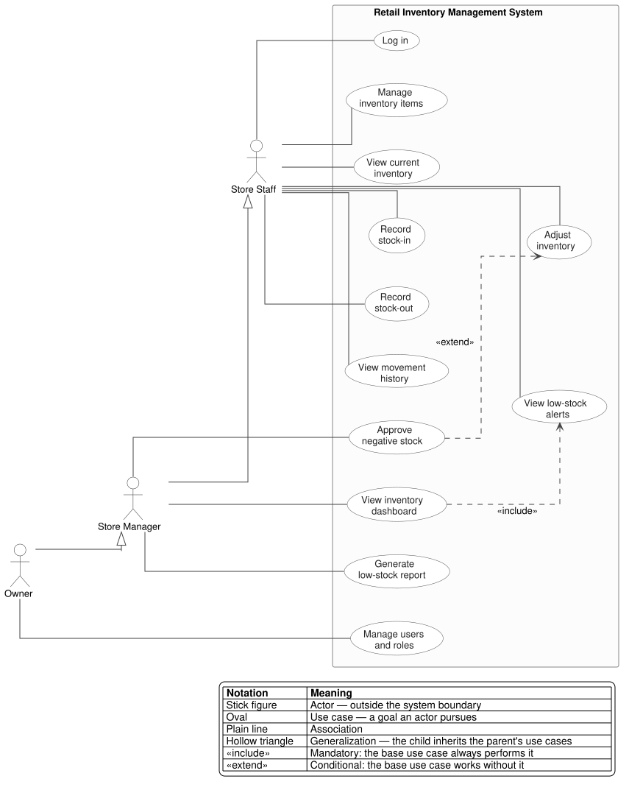

# Use Case Diagram

MVP scope, from [`statement-of-work-01.md`](../proposals/statement-of-work-01.md)
and [`discovery-and-scoping.md`](../discovery-and-scoping.md).
Structural counterpart: [`components_diagram.md`](./components_diagram.md).

Source: [`use_cases_diagram.puml`](./use_cases_diagram.puml) — edit that file, then
regenerate with `java -jar plantuml.jar -tsvg docs/design/use_cases_diagram.puml`.

---

Roles inherit down the chain: **Owner → Store Manager → Store Staff**, so the
Owner can perform every use case in the diagram.

> [!NOTE]
> That inheritance is still an assumption. `discovery-and-scoping.md` lists as
> open: *"Confirm whether Managers and Owners should have identical
> administrative permissions"*. If the roles turn out to overlap rather than
> nest, the generalization arrows become direct associations and nothing else
> changes.

Validating negative stock, rejecting movements on unknown items and writing the
audit record are **steps inside a use case**, not use cases — they belong in the
written flows. `Log in` is a **precondition** of every other use case, which is
why it is not drawn as `<<include>>` on all of them.
